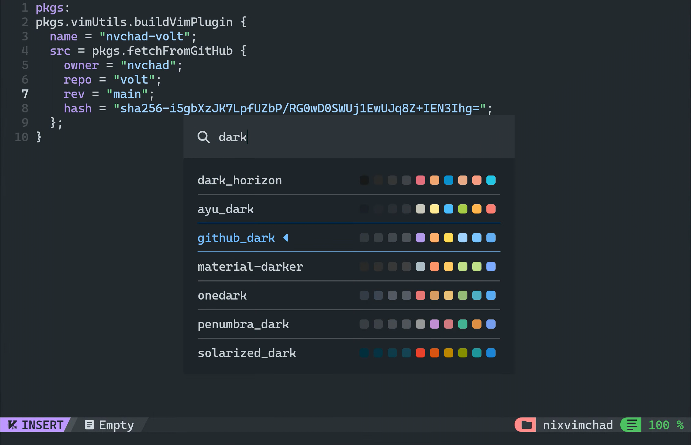

# NixvimChad - the NvChad config for NixvimChad

NixvimChad is a Neovim distribution built using [NixVim](https://github.com/nix-community/nixvim), designed to mimic [NvChad](https://nvchad.com) as closely as possible.



> [!WARNING]
> NixvimChad depends on features not currently present in upstream NixVim. The flake inputs for NixvimChad are therefore pointed to [my own fork of NixVim](https://github.com/thecolorman/nixvim). The input will be changed once upstream has the required features (see the fork diff for the features NixvimChad requires).

## Try

You can try out NixvimChad with the following command:

```bash
nix run github:thecolorman/nixvimchad
# or edit a file
nix run github:thecolorman/nixvimchat -- file.nix
```

## Why?

NvChad is a great set of default plugins for Neovim that turns the editor into an IDE. At the same time, NvChad (and Vim in a broader sense) relies on mutable configuration in your home directory, which goes against the immutable and declarative philosophy of Nix. NixVim was created to address this, being a Neovim distribution entirely designed around configuring Neovim using the Nix language.

NvChad is a very popular starting point for Neovim configurations, but getting it to work in is a pain due to the differing configuration philosophies. That's where NixvimChad comes in!

## How?

NixvimChad emulates every step of a normal NvChad configuration by manually converting NvChad's Lua code into a NixVim configuration. The entire program flow of the default NvChad configuration has been tirelessly converted to equivalent NixVim code, even making use of [lazy.nvim](https://lazy.folke.io/) for lazy-loading and bytecode compilation!

## Extending

You can use NixvimChad as the base for your own NixVim config by using the exposed `withExtension` helper.

> [!NOTE]
> `withExtension` is just a wrapper over NixVim's [`<nixvim>.extend`](https://nix-community.github.io/nixvim/platforms/standalone.html?highlight=extend#extending-an-existing-configuration) function. `withExtension` creates a package for each supported system, where `<nixvim>.extend` only extends a single package.

Nix flake template:

```nix
{
  inputs = {
    nixvimchad.url = "github:thecolorman/nixvimchad";
  };

  outputs = {nixvimchad}:
    nixvimchad.withExtension (import ./config) 
```

The `withExtension` function will generate `package` attributes. You can then write your NixVim config like normal:  

```nix
# config/default.nix
{ pkgs, ... }: {
  extraConfigLua = ''
    -- your lua config here
  '';
}
```

You can then run your configuration with `nix run` or add it as an input in your NixOS system flake to add the executable to your NixOS configuration.
